# dep-consumer

A demonstration consumer application showing how integration tests detect breaking changes in dependencies.

[](https://github.com/pravasna30-dev/dep-consumer/actions/workflows/ci.yml)

## Overview

This consumer application demonstrates how **integration tests act as an early warning system** when a library introduces breaking API changes. The tests are designed to fail at **compile-time** when the library's method signatures change.

## The Problem & Solution

```mermaid
graph TD
    subgraph Problem["❌ Without Contract Tests"]
        A[Library v2.0.0 Released] --> B[Consumer Upgrades Dependency]
        B --> C[Runtime Errors in Production!]
        C --> D[😱 Angry Users]
    end

    subgraph Solution["✅ With Contract Tests"]
        E[Library v2.0.0 Released] --> F[Consumer Upgrades Dependency]
        F --> G[CI Runs Tests]
        G --> H[Compile-Time Failure]
        H --> I[🛡️ Breaking Change Detected!]
        I --> J[Fix Before Production]
    end

    style Problem fill:#ff6b6b,color:#fff
    style Solution fill:#4ade80,color:#000
```



## Architecture

```mermaid
graph LR
    subgraph Consumer["Consumer Repository"]
        direction TB
        App[Application.java]
        IT[Integration Tests]
        CT[Contract Tests]
    end

    subgraph Library["Library Repository"]
        direction TB
        V1[v1.0.0<br/>main branch]
        V2[v2.0.0<br/>feature branch]
    end

    subgraph Maven["Maven Local"]
        M1[library:1.0.0]
        M2[library:2.0.0]
    end

    V1 -->|publish| M1
    V2 -->|publish| M2

    M1 -->|"✅ works"| App
    M2 -.->|"❌ breaks"| App

    App --> IT
    App --> CT

    style V2 fill:#ff6b6b,color:#fff
    style M2 fill:#ff6b6b,color:#fff
```



## Test Strategy

### 1. Integration Tests (`UserServiceIntegrationTest.java`)

Direct API usage with **explicit types** that fail at compile-time:

```java
@Test
void shouldFindExistingUserByLongId() {
    Long userId = 1L;  // Explicit Long type

    // This line fails to compile if signature changes to findById(String)
    User user = userService.findById(userId);

    // This line fails to compile if getId() returns String instead of Long
    assertThat(user.getId()).isEqualTo(1L);
}
```

### 2. Contract Tests (`ApiContractTest.java`)

Reflection-based tests that verify exact method signatures:

```java
@Test
void verifyFindByIdSignature() throws NoSuchMethodException {
    // Fails with NoSuchMethodException if method signature changes
    Method method = UserService.class.getMethod("findById", Long.class);
    assertThat(method.getReturnType()).isEqualTo(User.class);
}
```

## Breaking Change Detection Flow


## Animation: How Tests Catch Breaking Changes

```mermaid
stateDiagram-v2
    direction LR

    [*] --> LibraryV1: Library v1.0.0

    state LibraryV1 {
        direction TB
        [*] --> API1
        API1: findById(Long): User
        API1 --> Consumer1: Consumer uses API
        Consumer1: userService.findById(1L)
        Consumer1 --> Tests1: Tests pass ✅
    }

    LibraryV1 --> LibraryV2: Upgrade to v2.0.0

    state LibraryV2 {
        direction TB
        [*] --> API2
        API2: findById(String): Optional
        API2 --> Consumer2: Consumer uses old code
        Consumer2: userService.findById(1L)
        Consumer2 --> Compile: Compile Error! ❌
        Compile: "Long cannot be<br/>converted to String"
    }

    LibraryV2 --> Detected: Breaking Change Detected!

    state Detected {
        [*] --> Fix
        Fix: Developer fixes consumer<br/>or pins to v1.0.0
    }
```



## Local Development

### Prerequisites

- Java 21+ (JDK, not JRE)
- Gradle 8.5+ (wrapper included)
- [dep-library](https://github.com/pravasna30-dev/dep-library) published to Maven Local

### Setup

```bash
# Clone this repository
git clone https://github.com/pravasna30-dev/dep-consumer.git
cd dep-consumer

# Clone and publish the library first
git clone https://github.com/pravasna30-dev/dep-library.git ../dep-library
cd ../dep-library
./gradlew publishToMavenLocal -Pversion=1.0.0
cd ../dep-consumer
```

### Run Tests

```bash
# Test against library v1.0.0 (should PASS)
./gradlew test -PlibraryVersion=1.0.0

# Test against library v2.0.0 (should FAIL - demonstrates detection)
cd ../dep-library
git checkout feature/method-signature-change
./gradlew publishToMavenLocal -Pversion=2.0.0
cd ../dep-consumer
./gradlew test -PlibraryVersion=2.0.0
```

### Expected Output

**With v1.0.0 (Success):**
```
BUILD SUCCESSFUL in 5s
4 actionable tasks: 4 executed
```

**With v2.0.0 (Failure - Breaking Change Detected):**
```
> Task :compileTestJava FAILED

error: incompatible types: Long cannot be converted to String
        User user = userService.findById(userId);
                                         ^
error: incompatible types: Optional<User> cannot be converted to User
        User user = userService.findById(userId);
        ^

BUILD FAILED in 2s
```

## CI/CD Pipeline

### Workflow Overview

```mermaid
flowchart TD
    A[Push to GitHub] --> B[CI Triggered]

    B --> C[Job 1: Test with v1.0.0]
    B --> D[Job 2: Test with v2.0.0]

    subgraph Job1["Test with Library v1.0.0"]
        C --> C1[Checkout consumer]
        C1 --> C2[Checkout library main branch]
        C2 --> C3[Publish library v1.0.0]
        C3 --> C4[Run consumer tests]
        C4 --> C5[✅ Tests PASS]
    end

    subgraph Job2["Test with Library v2.0.0"]
        D --> D1[Checkout consumer]
        D1 --> D2[Checkout library feature branch]
        D2 --> D3[Publish library v2.0.0]
        D3 --> D4[Run consumer tests]
        D4 --> D5[❌ Compile FAILS]
        D5 --> D6[✅ Breaking change detected!]
    end

    C5 --> E[CI Complete]
    D6 --> E

    style D5 fill:#ff6b6b,color:#fff
    style D6 fill:#4ade80,color:#000
```



### Manual CI Trigger

```bash
# Using GitHub CLI
gh workflow run ci.yml --repo pravasna30-dev/dep-consumer

# With specific library version
gh workflow run ci.yml --repo pravasna30-dev/dep-consumer \
  -f library_version=2.0.0

# Check status
gh run list --repo pravasna30-dev/dep-consumer

# View logs
gh run view <run-id> --repo pravasna30-dev/dep-consumer --log
```

## Test Types Comparison

| Test Type | Detection Time | Failure Mode | Example |
|-----------|----------------|--------------|---------|
| **Integration Tests** | Compile-time | `incompatible types` error | `findById(1L)` fails when param becomes `String` |
| **Contract Tests** | Runtime | `NoSuchMethodException` | `getMethod("findById", Long.class)` fails |
| **Behavioral Tests** | Runtime | Assertion failure | `assertThat(user).isNull()` fails if exception thrown |

## Project Structure

```
dep-consumer/
├── build.gradle.kts           # Dependency on com.example:library
├── gradle.properties          # Default library version
├── src/
│   ├── main/java/
│   │   └── com/example/consumer/
│   │       └── Application.java
│   └── test/java/
│       └── com/example/consumer/
│           ├── UserServiceIntegrationTest.java  # Type-safe API tests
│           └── ApiContractTest.java             # Reflection-based tests
└── .github/
    └── workflows/
        └── ci.yml             # CI pipeline
```

## Related Repositories

| Repository | Description |
|------------|-------------|
| [dep-library](https://github.com/pravasna30-dev/dep-library) | The library this consumer depends on |
| [dep-multimodule](https://github.com/pravasna30-dev/dep-multimodule) | Single repo with both library and consumer |

## License

MIT
